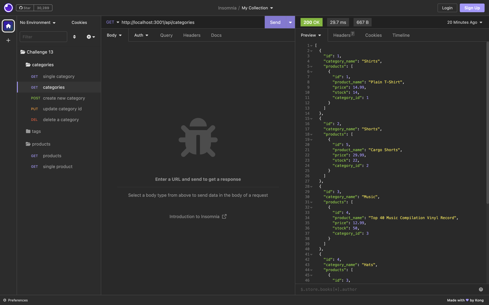

# e-commerce-backend app
  
  ## Licensing: MIT 

  ## Description
   This back end application has and accepts new categories, products, and tags for products which can be viewed and updated through api routes. We will be testing each api route on this app with Insomnia. The methods we will be utilizing include the GET, POST, PUT, and DELETE methods to view and update our models (categories, tags, products).

  ## Table of Contents
  
  -[Installation and Usage](#installation)
  -[Credits](#credits)
  -[License](#license)  
  -[Tech used](#tech-used)

  ## Installation and Usage
  You may download the starter code at https://github.com/ALugo0823/e-commerce-backend 
  The following steps will help you run the app:
  1. In the integrated terminal, enter 'npm i' to install the dependencies from our package.json file
  2. Login to your MySQL by entering 'mysql -u root -p' in the terminal. You will be prompted to enter your password.
  3. Once logged in, enter in the terminal 'source db/schema.sql'; 
  4. Now, enter 'quit;' to exit mySQL.
  5. Next, in the terminal enter 'npm run seed' to seed all the data we will need
  6. Finally, enter 'npm start' to initiate the server

  Walkthrough video: https://drive.google.com/file/d/1O22K3lLA_QgRZ1DrYPphsp2xqgThhSRj/view
  

  ## Tech used
  * JavaScript
  * Node.JS
  * Express
  * MySQL
  * Insomnia

  ## Credits
  
  - Collaborators: N/A

  ## Questions
  Have any questions or concerns? Here is where you can reach me:
  - Github: alugo0823
  - Email: lugo.kse23@gmail.com
  
  ## Screenshot
  